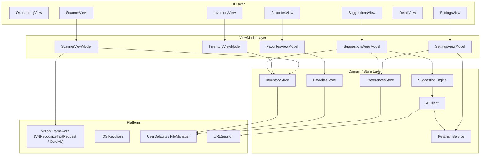

# Design Document: LunchBox Prep iOS

## Overview

LunchBox Prep is a privacy-first iOS application that combines on-device camera vision with user-configured AI APIs to turn a quick fridge/pantry scan into actionable lunch box recipes. The app follows a bring-your-own-key (BYOK) model — no backend, no analytics, no data leaves the device except to the AI endpoint the user explicitly configures.

The core user flow is:
1. Configure API key and (optionally) dietary preferences once
2. Open the scanner, point at food items, confirm detections
3. Tap "Get Lunch Box Ideas" — the app sends the inventory + preferences to the AI
4. Browse, save, and share the returned recipes

The app targets iOS 16+ and is built with SwiftUI + Combine, using Apple's Vision framework for on-device food detection and the iOS Keychain for secure credential storage.

---

## Architecture

The app uses a layered MVVM architecture with a unidirectional data flow. Each screen has a dedicated ViewModel; shared state (inventory, preferences, favorites) lives in observable stores injected via the SwiftUI environment.



### Key Architectural Decisions

- SwiftUI + Combine: Declarative UI with reactive bindings keeps ViewModels thin and testable.
- No third-party networking library: `URLSession` with `async/await` is sufficient and avoids supply-chain risk.
- Vision framework for scanning: `VNRecognizeTextRequest` + a lightweight CoreML food classifier handles on-device detection without sending camera frames anywhere.
- Keychain for API key: `Security.framework` SecItem APIs — never `UserDefaults`.
- `Codable` + `FileManager` for persistence: Simple JSON files in the app's Documents directory for favorites; `UserDefaults` for lightweight preferences.

---

## Components and Interfaces

### KeychainService

Responsible for storing and retrieving the API key securely.

```swift
protocol KeychainServiceProtocol {
    func save(apiKey: String) throws
    func loadAPIKey() throws -> String
    func deleteAPIKey() throws
}
```

### AIClient

Handles all HTTP communication with the configured AI endpoint.

```swift
protocol AIClientProtocol {
    func fetchSuggestions(prompt: String) async throws -> [LunchBoxIdea]
}

struct AIClientConfig {
    var baseURL: URL          // e.g. https://api.openai.com/v1
    var apiKey: String
    var model: String         // e.g. "gpt-4o-mini"
}
```

The client sends a single `/chat/completions` request with a structured system prompt that instructs the model to return JSON matching the `LunchBoxIdea` schema. Response parsing uses `JSONDecoder` with a strict schema — any malformed response surfaces as a `AIClientError.invalidResponse`.

### SuggestionEngine

Formats the inventory and dietary preferences into a prompt and delegates to `AIClient`.

```swift
protocol SuggestionEngineProtocol {
    func getSuggestions(
        inventory: [InventoryItem],
        preferences: DietaryPreferences
    ) async throws -> [LunchBoxIdea]
}
```

The engine builds a deterministic prompt string from its inputs, making it straightforward to unit-test prompt construction independently of the network.

### InventoryStore

Observable store holding the current session's inventory.

```swift
@MainActor
final class InventoryStore: ObservableObject {
    @Published private(set) var items: [InventoryItem] = []

    func add(_ item: InventoryItem)
    func update(_ item: InventoryItem)
    func remove(id: UUID)
    func clear()
}
```

### PreferencesStore

Persists dietary preferences to `UserDefaults`.

```swift
@MainActor
final class PreferencesStore: ObservableObject {
    @Published var preferences: DietaryPreferences

    func save()
    func reset()
}
```

### FavoritesStore

Persists saved `LunchBoxIdea` values to a JSON file in the app's Documents directory.

```swift
@MainActor
final class FavoritesStore: ObservableObject {
    @Published private(set) var favorites: [LunchBoxIdea] = []  // reverse-chronological

    func save(_ idea: LunchBoxIdea) throws
    func delete(id: UUID) throws
    func load() throws
}
```

### ScannerViewModel

Manages the `AVCaptureSession` lifecycle and bridges Vision results to the `InventoryStore`.

```swift
@MainActor
final class ScannerViewModel: ObservableObject {
    @Published var detectedItems: [DetectedItem] = []
    @Published var cameraPermissionStatus: AVAuthorizationStatus

    func startSession()
    func stopSession()
    func confirm(_ item: DetectedItem)
    func dismiss(_ item: DetectedItem)
    func addManualItem(name: String)
}
```

---

## Data Models

```swift
// A single item in the current inventory
struct InventoryItem: Identifiable, Codable, Equatable {
    let id: UUID
    var name: String
    var quantity: String   // free-text, e.g. "2 cups", "half a block"
}

// A food item detected by the scanner (pre-confirmation)
struct DetectedItem: Identifiable, Equatable {
    let id: UUID
    let name: String
    let confidence: Float  // 0.0 – 1.0
}

// A lunch box recipe returned by the AI
struct LunchBoxIdea: Identifiable, Codable, Equatable {
    let id: UUID
    var name: String
    var ingredients: [String]
    var preparationSteps: [String]
    var savedAt: Date?     // non-nil when persisted to favorites
}

// Dietary filter flags
struct DietaryPreferences: Codable, Equatable {
    var vegetarian: Bool = false
    var vegan: Bool = false
    var glutenFree: Bool = false
    var dairyFree: Bool = false
    var nutFree: Bool = false
}

// AI API request/response shapes (OpenAI chat completions)
struct ChatCompletionRequest: Encodable {
    let model: String
    let messages: [ChatMessage]
    let responseFormat: ResponseFormat
}

struct ChatMessage: Codable {
    let role: String   // "system" | "user" | "assistant"
    let content: String
}

struct ResponseFormat: Encodable {
    let type: String   // "json_object"
}

// Errors
enum AIClientError: Error, LocalizedError {
    case missingAPIKey
    case networkUnavailable
    case httpError(statusCode: Int, body: String)
    case invalidResponse(String)
    case insufficientSuggestions(count: Int)  // fewer than 3 returned
}

enum KeychainError: Error {
    case itemNotFound
    case duplicateItem
    case unexpectedStatus(OSStatus)
}
```

### Persistence Layout

| Data | Storage | Format |
|---|---|---|
| API Key | iOS Keychain | SecItem (kSecClassGenericPassword) |
| Base URL, Model | UserDefaults | String |
| Dietary Preferences | UserDefaults | JSON-encoded `DietaryPreferences` |
| Favorites | Documents/favorites.json | JSON array of `LunchBoxIdea` |
| Inventory | In-memory only (InventoryStore) | — |

Inventory is intentionally not persisted between launches — each session starts fresh, matching the "quick scan before packing" use case.


---

## Correctness Properties

*A property is a characteristic or behavior that should hold true across all valid executions of a system — essentially, a formal statement about what the system should do. Properties serve as the bridge between human-readable specifications and machine-verifiable correctness guarantees.*

### Property 1: API key Keychain round-trip

*For any* non-empty API key string, saving it via `KeychainService.save(apiKey:)` and then loading it via `KeychainService.loadAPIKey()` should return a value equal to the original string. Additionally, the key should not be present in `UserDefaults` after saving.

**Validates: Requirements 2.2**

---

### Property 2: Empty/whitespace API key is rejected

*For any* string composed entirely of whitespace characters (including the empty string), calling `SettingsViewModel.saveAPIKey(_:)` should return a validation error and the Keychain should remain unchanged.

**Validates: Requirements 2.3**

---

### Property 3: AIClient uses configured base URL

*For any* base URL and any inventory prompt, the HTTP request constructed by `AIClient` should have a URL whose scheme and host match the configured base URL, ensuring no data is sent to an unexpected endpoint.

**Validates: Requirements 2.5, 9.1**

---

### Property 4: Confidence threshold filters detections

*For any* `DetectedItem`, it should only appear in `ScannerViewModel.detectedItems` if its `confidence` value is greater than or equal to the configured minimum confidence threshold.

**Validates: Requirements 3.4**

---

### Property 5: Confirm adds, dismiss does not

*For any* `DetectedItem` presented by the scanner, calling `confirm(_:)` should result in a corresponding `InventoryItem` appearing in `InventoryStore.items`, while calling `dismiss(_:)` on any item should leave `InventoryStore.items` unchanged.

**Validates: Requirements 3.5**

---

### Property 6: Manual item addition

*For any* non-empty string passed to `ScannerViewModel.addManualItem(name:)`, an `InventoryItem` with that name should appear in `InventoryStore.items` after the call.

**Validates: Requirements 3.6**

---

### Property 7: Inventory item update is reflected immediately

*For any* `InventoryItem` in the store and any new non-empty name string, calling `InventoryStore.update(_:)` with the modified item should result in the item at that `id` having the new name, with all other items unchanged.

**Validates: Requirements 4.2**

---

### Property 8: Inventory item removal

*For any* `InventoryStore` containing at least one item, calling `remove(id:)` with a valid item id should result in that item no longer appearing in `items`, and the count decreasing by exactly one.

**Validates: Requirements 4.3**

---

### Property 9: Clear empties the inventory

*For any* non-empty `InventoryStore`, calling `clear()` should result in `items` being empty.

**Validates: Requirements 4.4**

---

### Property 10: Suggestions enabled iff inventory non-empty

*For any* `InventoryStore` state, `canRequestSuggestions` should be `true` if and only if `items` is non-empty.

**Validates: Requirements 4.5, 4.6**

---

### Property 11: Prompt contains all inventory items and active preferences

*For any* non-empty inventory and any `DietaryPreferences` value, the prompt string produced by `SuggestionEngine` should contain every inventory item name and every active dietary preference label (e.g. "vegetarian", "gluten-free").

**Validates: Requirements 5.1, 6.2**

---

### Property 12: API key appears in Authorization header

*For any* API key string, the `URLRequest` constructed by `AIClient` should contain an `Authorization` header with value `"Bearer <apiKey>"`.

**Validates: Requirements 5.2**

---

### Property 13: Response must contain at least 3 suggestions

*For any* AI API response payload, if the parsed `LunchBoxIdea` array contains fewer than 3 items, `AIClient` should throw `AIClientError.insufficientSuggestions` rather than returning the partial list.

**Validates: Requirements 5.3**

---

### Property 14: Every LunchBoxIdea has required fields

*For any* `LunchBoxIdea` value returned by the suggestion engine, `name` must be non-empty, `ingredients` must be a non-empty array, and `preparationSteps` must be a non-empty array.

**Validates: Requirements 5.4**

---

### Property 15: HTTP errors produce human-readable descriptions

*For any* HTTP status code in the 4xx–5xx range, `AIClient` should throw an `AIClientError.httpError` whose `localizedDescription` is a non-empty, human-readable string.

**Validates: Requirements 5.6**

---

### Property 16: Dietary preferences round-trip through persistence

*For any* `DietaryPreferences` value, saving it via `PreferencesStore.save()` and then loading it in a fresh `PreferencesStore` instance should produce an equal value.

**Validates: Requirements 6.3**

---

### Property 17: Cleared preferences produce unconstrained prompt

*For any* `SuggestionEngine`, after calling `PreferencesStore.reset()`, the generated prompt should contain none of the dietary constraint keywords ("vegetarian", "vegan", "gluten-free", "dairy-free", "nut-free").

**Validates: Requirements 6.4**

---

### Property 18: Share text contains all idea fields

*For any* `LunchBoxIdea`, the plain-text string produced by the share formatter should contain the idea's `name`, every string in `ingredients`, and every string in `preparationSteps`.

**Validates: Requirements 7.2**

---

### Property 19: Save to favorites round-trip

*For any* `LunchBoxIdea`, calling `FavoritesStore.save(_:)` should result in an item with the same `id` and `name` appearing in `FavoritesStore.favorites`.

**Validates: Requirements 7.3**

---

### Property 20: Favorites are in reverse chronological order

*For any* sequence of `LunchBoxIdea` values saved to `FavoritesStore` at distinct times, `favorites` should be ordered so that the most recently saved idea appears first (i.e., `favorites[0].savedAt >= favorites[1].savedAt` for all adjacent pairs).

**Validates: Requirements 8.1**

---

### Property 21: Favorites deletion

*For any* `FavoritesStore` containing at least one idea, calling `delete(id:)` with a valid id should result in that idea no longer appearing in `favorites`, and the count decreasing by exactly one.

**Validates: Requirements 8.3**

---

### Property 22: Favorites persist across store reloads (serialization round-trip)

*For any* set of `LunchBoxIdea` values saved to disk by `FavoritesStore`, creating a new `FavoritesStore` instance and calling `load()` should produce a `favorites` array equal (by `id` and content) to the original saved set.

**Validates: Requirements 8.4**

---

## Error Handling

### Error Categories

| Error | Source | User-Facing Behavior |
|---|---|---|
| `KeychainError.itemNotFound` | KeychainService | Settings screen shows "No API key saved" state |
| `AIClientError.missingAPIKey` | AIClient | Alert directing user to Settings |
| `AIClientError.networkUnavailable` | AIClient | Offline banner; no retry spinner |
| `AIClientError.httpError(401, _)` | AIClient | "Invalid API key" message + Settings shortcut |
| `AIClientError.httpError(429, _)` | AIClient | "Rate limit reached — try again shortly" |
| `AIClientError.httpError(5xx, _)` | AIClient | "Service unavailable — please retry" + retry button |
| `AIClientError.invalidResponse` | AIClient | "Unexpected response from AI — please retry" |
| `AIClientError.insufficientSuggestions` | AIClient | "Not enough suggestions returned — please retry" |
| Camera permission denied | ScannerViewModel | Explanation sheet + "Open Settings" button |
| `FavoritesStore` decode failure | FavoritesStore | Log error, present empty favorites (data not lost — raw file preserved) |

### Error Propagation

- ViewModels catch errors from domain services and map them to `@Published var errorState: AppError?`
- Views observe `errorState` and present `.alert` or inline error UI
- Errors are never silently swallowed — every `catch` either re-throws or sets `errorState`
- Network errors are distinguished from API errors at the `URLSession` level before reaching `AIClient`

---

## Testing Strategy

### Dual Testing Approach

Both unit tests and property-based tests are required. They are complementary:
- Unit tests catch concrete bugs with specific inputs and verify integration points
- Property tests verify universal correctness across the full input space

### Property-Based Testing

The project uses **SwiftCheck** (Swift port of QuickCheck) for property-based testing.

Each property test must:
- Run a minimum of **100 iterations**
- Be tagged with a comment in the format: `// Feature: lunchbox-prep-ios, Property N: <property text>`
- Reference the design document property it implements
- Use `Arbitrary` instances for all generated types (`InventoryItem`, `LunchBoxIdea`, `DietaryPreferences`, etc.)

Example:
```swift
// Feature: lunchbox-prep-ios, Property 1: API key Keychain round-trip
func testAPIKeyKeychainRoundTrip() {
    property("Any non-empty API key survives a Keychain save/load round-trip") <- forAll { (key: NonEmptyString) in
        let sut = KeychainService(service: "test.\(UUID())")
        try? sut.save(apiKey: key.value)
        return (try? sut.loadAPIKey()) == key.value
    }
}
```

Properties to implement (one test per property):

| Property | Test Focus |
|---|---|
| 1 | KeychainService save/load round-trip |
| 2 | Empty/whitespace key validation |
| 3 | AIClient request URL matches configured base URL |
| 4 | Confidence threshold filtering in ScannerViewModel |
| 5 | Confirm adds item; dismiss does not |
| 6 | Manual item addition |
| 7 | Inventory update correctness |
| 8 | Inventory removal correctness |
| 9 | Inventory clear |
| 10 | canRequestSuggestions iff non-empty |
| 11 | Prompt contains all items and active preferences |
| 12 | Authorization header contains API key |
| 13 | Fewer than 3 suggestions throws error |
| 14 | LunchBoxIdea structural invariant |
| 15 | HTTP errors produce human-readable descriptions |
| 16 | DietaryPreferences persistence round-trip |
| 17 | Cleared preferences produce unconstrained prompt |
| 18 | Share text contains all idea fields |
| 19 | Save to favorites round-trip |
| 20 | Favorites reverse-chronological ordering |
| 21 | Favorites deletion correctness |
| 22 | Favorites serialization round-trip |

### Unit Tests

Unit tests focus on:
- Specific examples: known good/bad API key formats, specific HTTP status codes (401, 429, 500)
- Integration points: `SuggestionEngine` calling `AIClient` with a mock, `FavoritesStore` writing/reading a real temp file
- Edge cases: empty inventory prompt, all dietary flags set simultaneously, favorites list with a single item

Avoid writing unit tests that duplicate property test coverage — if a property test already covers a behavior across all inputs, a unit test for a single example of that behavior adds little value.

### UI / Integration Tests

- XCUITest for the onboarding → settings → scan → suggestions happy path
- XCUITest for camera permission denial flow
- XCUITest for offline error state
- These are smoke tests only; correctness is covered by unit + property tests
